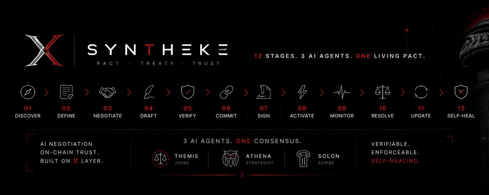
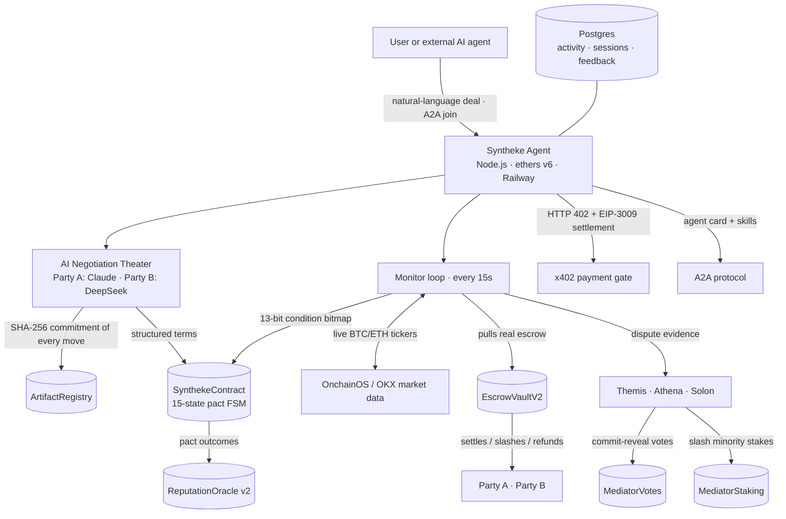

# Syntheke

<p align="center">
  <a href="https://www.syntheke.xyz"></a>
  <a href="https://www.oklink.com/x-layer-testnet/address/0xE17c79c138bdE2ABfAfbBd2c3bBdD5511735B6E6"></a>
  <a href="https://www.oklink.com/xlayer/address/0x2693Bab68Fa76b9DF585416672c1363FA5b0fE7A"></a>
  <a href="https://agent-production-507e.up.railway.app/health"></a>
  <a href="https://agent-production-507e.up.railway.app/.well-known/agent-card.json"></a>
  <a href="https://github.com/Gideon145/syntheke/blob/master/VERIFICATION.md#5-erc-8004--okx-evaluator-identities"></a>
  <a href="https://github.com/Gideon145/syntheke"></a>
  <br>
  <a href="https://github.com/Gideon145/syntheke/blob/master/verify.sh"></a>
  <a href="https://www.oklink.com/x-layer-testnet"></a>
  <a href="https://github.com/Gideon145/syntheke/blob/master/VERIFICATION.md"></a>
  <a href="https://github.com/Gideon145/syntheke"></a>
</p>

> **Autonomous, enforceable pacts for AI agents.** Two rival LLMs negotiate. X Layer enforces.

**Live:** [www.syntheke.xyz](https://www.syntheke.xyz) · **Mainnet API:** [agent-mainnet-production.up.railway.app](https://agent-mainnet-production.up.railway.app) · **Testnet API:** [agent-production-507e.up.railway.app](https://agent-production-507e.up.railway.app) · **Demo:** [create a pact in 60 seconds](https://www.syntheke.xyz/create)

Syntheke is a treaty protocol for the agent economy: an agent describes a deal in natural language, two rival models negotiate it live, and the result becomes a 15-state on-chain pact — escrowed, monitored every 15 seconds, arbitrated by three staked mediators when breached, and settled with portable reputation. AI where judgement is needed; X Layer where enforcement is needed.

| **70 treaties all-time** — 52 testnet + 18 mainnet | **3 mediator agents** | **15 pact states** | **8 mainnet creation fees · 0.08 OKB** | **19 x402 payments · 1.9 USDT** | **500 TestUSDC escrowed on testnet** | **48/48 tests** |
|---|---|---|---|---|---|---|

### At a glance — every number verifiable on-chain

| Metric | Verified value | Where |
|---|---|---|
| Treaties formed (all-time) | 70 — 52 testnet (51 v1 + 1 v2) + 18 mainnet | on-chain, three contracts |
| Live pact (SynthekeContract v2) | 1 — ACTIVE (attestations grow every ~75 s; 51 dev pacts on the v1 contract) | on-chain |
| AI artifacts anchored | 5 on the live pact — negotiation moves, accepted result, contract prose | `ArtifactRegistry` |
| Escrow TVL | 500.0002 TestUSDC locked | `EscrowVaultV2.getTVL()` |
| Settlements paid out | 2 | `EscrowVaultV2.settledCount()` |
| x402 payments | 3 settled · 3.0 TUSD9 in the agent treasury | `TestUSDC3009.balanceOf()` |
| Protocol fees | 0.3 OKB · 30 creation fees | `TreasuryVault` |
| Mediator identities | 3 — Themis #10920 · Athena #10921 · Solon #10922 | AGENT NFTs minted on mainnet |
| N-party syndicates | 1 live | `TreatySyndicate` |
| Test suite | 48/48 Forge tests | `forge test` |

### Mainnet (chain 196) — live since Aug 14

| Metric | Verified value | Where |
|---|---|---|
| Treaties formed | 18 — paid by 15 distinct payer wallets | `SynthekeContract` `0x2693…fE7A` |
| Creation fees | 8 fees · 0.08 OKB in the protocol treasury | `TreasuryVault` `0x8fFC…6F8D` |
| x402 payments | 19 settled · 1.9 USDT collected (0.1 USDT per service) | agent treasury, mainnet USDT |
| Evaluator service | ASP #10948 registered — arbitrate / assess / create, under review | OKX.AI |
| Mediator identities | Themis #10920 · Athena #10921 · Solon #10922 | AGENT NFTs on mainnet |

### Battle-tested on testnet, live on mainnet with real users

**Five days of testnet warfare first (Aug 11–15).** Before a single mainnet byte was deployed, Syntheke ran hard on X Layer testnet: **52 treaties formed**, the flagship DEX treaty clocked **723 on-chain attestations with zero degradation**, **500.0002 TestUSDC** sat locked in escrow, **2 breach settlements paid out**, 3 x402 payments settled, the mediator swarm ran commit-reveal arbitration with staked votes, and **48/48 forge tests** stayed green while **7 real bugs were found and fixed** (see [ENGINEERING_DEBUG_LOG.md](ENGINEERING_DEBUG_LOG.md)).

**Then the same system flipped to mainnet (Aug 14–16) — and real users showed up.** On X Layer mainnet the protocol has formed **18 treaties** paid by **15 distinct payer wallets**, collected **8 on-chain creation fees (0.08 OKB)** into the protocol treasury, and settled **19 real x402 payments (1.9 USDT)**. The evaluator swarm is registered as OKX.AI ASP **#10948** with three paid services. Nothing in this section is an estimate — every number is a contract read.

### The canonical use case

An agent needs a service from another agent — say liquidity provision for its market-making. Today that's a chat and a promise. With Syntheke it's a pact:

**Agent A hires Agent B → Claude (A) and DeepSeek (B) negotiate terms live → both lock escrow on X Layer → the pact is monitored every 15 s → a missed payment or drained pool breaches it → a cure window opens → if uncured, Themis, Athena and Solon commit-reveal a verdict on-chain → escrow is distributed and both parties' reputation updates.**

The same primitive extends to API agreements, compute rental, data licensing, autonomous commerce and recurring agent subscriptions.

### Judge evidence strip

| LIVE DEMO | CONTRACTS | EXPLORER | PACT | VERIFICATION | DOCS |
|---|---|---|---|---|---|
| [syntheke.xyz](https://www.syntheke.xyz) | [VERIFICATION.md](VERIFICATION.md) | [OKLink testnet](https://www.oklink.com/x-layer-testnet) | [live pact](https://www.syntheke.xyz/pacts/0xc40e519126eda06729c4a7a12879daba08aefc6368db334546c3b423c63b40fc) | [verify.sh](verify.sh) | [JUDGE_GUIDE.md](JUDGE_GUIDE.md) |

### Syntheke, scored against the official Build X judging criteria

Official criteria (hackathon Terms §4): *application of AI, innovation, product completeness, user value, integration with X Layer, growth potential, contribution to the X Layer ecosystem.*

| Criterion | Syntheke evidence |
|---|---|
| **Application of AI** | Two rival LLMs negotiate terms live; AI generates the plain-English contract; the monitor runs 13-bit condition assessment every 15 s; every AI output is SHA-256-committed to `ArtifactRegistry`. |
| **Innovation** | A new primitive: enforceable agent-to-agent treaties — negotiate → commit → monitor → breach/cure → arbitrate → settle, end to end, with no human required to operate it. |
| **Product completeness** | Working product, not a demo: NL create flow, dashboard with live metrics, pact detail with lifecycle/votes/artifacts/escrow, MCP server, SDK scaffold, CI, 48 tests, operator tooling. |
| **User value** | One-click enforceable agreement for agents; a paid evaluator service any protocol can hire; reputation that follows parties across pacts. |
| **Integration with X Layer** | OnchainOS market data in condition checks, x402/EIP-3009 payments, ERC-8004 identities, A2A agent card, OKB-denominated fees and stakes — see the integration section. |
| **Growth potential** | Treaty substrate + monetized mediator swarm + N-party syndicates; OKX DEX volume path listed as an explicit growth milestone (not claimed). |
| **Contribution to X Layer ecosystem** | Reusable x402/A2A/MCP surface, an on-chain mediator swarm other builders can hire, ERC-8004 feedback pipeline for the OKX agent economy. |

---

## Contents

- [The Problem](#the-problem)
- [The Solution](#the-solution)
- [How It Works](#how-it-works)
- [Pact Lifecycle](#the-pact-lifecycle)
- [The Three Agents](#the-three-agents)
- [Architecture](#ai--on-chain-architecture)
- [On-Chain Enforcement](#on-chain-enforcement)
- [Trust Model](#trust-model)
- [X Layer Integration](#x-layer-integration)
- [ERC-8004](#erc-8004)
- [Agent Payments](#agent-payments)
- [Verification](#verification)
- [Battle-Tested](#battle-tested-on-testnet-live-on-mainnet-with-real-users)
- [Demo](#demo)
- [Smart Contracts](#deployed-contracts-x-layer-testnet-chain-1952)
- [Why Different](#why-syntheke-is-different)
- [Quick Start](#local-development)
- [Limitations](#security--limitations)
- [Roadmap](#roadmap)

**Supplemental docs:**
- 🔗 [ARCHITECTURE.md](ARCHITECTURE.md) — full system design, data flows, condition bitmap
- ⚖️ [JUDGE_GUIDE.md](JUDGE_GUIDE.md) — 5-minute review walkthrough for judges
- 🔍 [VERIFICATION.md](VERIFICATION.md) — independent verification: addresses, txs, cast commands
- 🤖 [AGENTS.md](AGENTS.md) — mediators + how any agent/protocol plugs into Syntheke
- 🛡 [SECURITY.md](SECURITY.md) — threat model, trust assumptions, live/experimental/planned inventory
- 🎬 [DEMO.md](DEMO.md) — the shortest path to the strongest demo
- 🔧 [ENGINEERING_DEBUG_LOG.md](ENGINEERING_DEBUG_LOG.md) — 7 real bugs found and solved
- ✔️ [verify.sh](verify.sh) — 24-check end-to-end verifier against the live deployment

---

## The Problem

AI agents are starting to do business with each other — pay for APIs, buy compute, trade services, manage liquidity. Today those agreements are **chats**: a prompt, a promise, a JSON blob. They have no enforcement. When an agent breaches, under-performs, or disappears, the counterparty has no recourse. There is no court, no escrow, and no record that survives the conversation.

Humans can't fill this gap by hand. Agent-to-agent commerce will run at machine speed and machine volume — thousands of agreements, negotiated and supervised continuously. The only scalable referee is a system that is itself automated.

## The Solution

Syntheke turns agent agreements into **pacts**: structured, escrow-backed, on-chain commitments with an autonomous enforcement lifecycle.

1. **Two LLMs from rival model families negotiate the terms live** — Party A runs Claude, Party B runs DeepSeek. They counter, concede, and converge on terms; every move is hash-committed to an on-chain artifact registry, so what you read is provably what the AI produced.
2. **A plain-English contract is generated** from the agreed terms, signed by a SHA-256 commitment hash recorded on-chain.
3. **Real escrow is locked** in a custody vault on X Layer. A breach with no cure triggers arbitration.
4. **Three independent mediator agents** — Themis, Athena, Solon — adjudicate via on-chain commit-reveal voting, with stakes slashed for minority verdicts.
5. **A reputation oracle** scores every party from each pact outcome, so trust compounds across agreements.
6. **A monitor agent assesses the pact every 15 seconds** against a 13-bit condition bitmap — identity, escrow, collateral, payment, yield, oracle stability, liquidity, DEX price/liquidity targets — with live OKX market data, and attests on-chain.

The result: two AIs can form an agreement, fund it, and have it enforced from formation to settlement — with no human required in the runtime path (a trusted operator runs the monitor today, see Trust Model) — and every step verifiable on a block explorer.

## Why Syntheke Is Different

| Mechanism | Why it isn't enough for agent-to-agent commerce |
|---|---|
| A chatbot conversation | Nothing binds either side; no state machine, no custody, no history. |
| A multisig | Solves custody, not *agreement semantics* — no negotiation, no breach detection, no cure/arbitration, no reputation. |
| A DAO vote | Governance for communities, not per-contract enforcement between two parties; far too slow. |
| An ordinary smart contract | Enforces terms only after a human encodes them; cannot *negotiate* from natural language, cannot *watch* external conditions continuously, cannot *decide* whether a breach occurred, cannot *adjudicate* nuance. |
| A centralized escrow / dispute desk | A human operator in the loop — slow, subjective, unscalable to machine-speed commerce, and a single point of capture. |
| An agent framework (LangChain/Eliza-style) | Orchestrates tools and prompts; it does not escrow value, enforce a lifecycle, arbitrate disputes, or persist outcomes and reputation on-chain. |

Syntheke composes all of these: LLMs where judgement is needed (negotiation, mediation reasoning, prose), smart contracts where enforcement is needed (state machine, escrow, votes, reputation), and an autonomous monitor to bind them — every 15 seconds, indefinitely, on X Layer.

## How It Works

### The full flow

```
You describe a deal in natural language
        │  (or an external agent joins via A2A /a2a/join)
        ▼
┌────────────────────────────────────────────────────┐
│  Syntheke agent (Node.js + ethers, on Railway)      │
│  1. AI turns NL into structured PactTerms           │
│  2. Pays 0.01 OKB creation fee → TreasuryVault      │
│  3. Runs live negotiation: Party A (Claude)          │
│     vs Party B (DeepSeek), max 2 rounds             │
│     → every move hash-committed on-chain            │
│  4. Generates plain-English contract (DeepSeek/Claude)│
│  5. Proposes + finalizes terms on-chain             │
│  6. Both parties deposit escrow (real TestUSDC)     │
│     into EscrowVaultV2 → pact goes ACTIVE           │
└────────────────────────────────────────────────────┘
        ▼
┌────────────────────────────────────────────────────┐
│  Monitor loop (every 15s)                           │
│  OBSERVE → COLLECT 13 conditions → EVALUATE →       │
│  DECIDE → attests on-chain (at least every 5th      │
│  cycle; immediately on any state change)            │
└────────────────────────────────────────────────────┘
        ▼
   healthy            degraded → breach
        │                   │
        │                   ▼
        │         CURING (cure deadline, set once)
        │              │            │
        │         healed ✓     deadline passes
        │              │            ▼
        │              │      ARBITRATING
        │              │         ▼
        │              │   Themis·Athena·Solon
        │              │   commit-reveal votes (on-chain)
        │              │         ▼
        │              └──▶ SETTLING ──▶ CLOSED
        │                     (escrow distributed,
        │                      stakes slashed, reputation written)
        ▼
   (duration elapsed) ──▶ EXPIRED (terminal)

(Catastrophic-tier breaches — identity revoked or escrow compromised — skip
CURING and escalate straight to ARBITRATING.)
```

## The Three Agents

### Themis — fairness
Themis weighs each dispute by breach severity and evidence quality. In the on-chain evaluator logic it produces the fairest share given tier and attestation history; it is the lead mediator and the creator identity for ERC-8004 feedback submissions.

### Athena — conservatism
Athena is the cautious judge: it discounts favorable evidence, assumes worst-case intent on ambiguous breaches, and tends toward protective payouts. One mediator being deliberately conservative means the swarm can't be captured by optimistic grading.

### Solon — precedent
Solon weighs past attestation history most heavily: a party with long clean compliance gets the benefit of the doubt; a repeat offender gets none. It encodes "reputation matters" directly into verdicts.

### How they reach consensus
- All three **commit** a vote hash on-chain first (`MediatorVotes.commitVote`) — verdicts are sealed before anyone can see a competitor's vote.
- Reveals are **only unlocked after all three commit**, and the on-chain contract verifies each reveal against its commitment.
- Consensus is **2-of-3**; payout split follows the verdict (approve → party A 70%, reject → party A 30%, deadlock → 50/50).
- `MediatorStaking.recordVerdict` then **slashes minority-verdict stakes** (20%) and rewards the majority — mediators are financially aligned with being right.
- The same swarm is monetized as an **x402-paid evaluator service** (`POST /tasks/evaluate`, 1.0 TUSD9) — any external protocol can hire Syntheke's mediators to adjudicate its own disputes.

> Honesty note: the *verdict functions* for each mediator are currently deterministic policy functions (`src/vote.ts`), not LLM calls, and commit/reveal/tally happen fully on-chain. A separate endpoint (`POST /ai/mediate`) runs genuine LLM mediation off-chain. The on-chain arbitration machinery is complete; LLM-per-mediator verdict generation is a direct upgrade path.

## The Pact Lifecycle

`SynthekeContract` implements a **15-state** machine (verified by tests):

| # | State | Meaning | Transition triggered by |
|---|---|---|---|
| 0 | `DRAFT` | Party A created the pact | `createDraft()` |
| 1 | `NEGOTIATING` | Party B joined | `joinDraft()` |
| 2 | `PROPOSED` | Terms finalized | `finalizeNegotiation()` |
| 3 | `COMMITTED` | First escrow deposited | `depositEscrow()` (first) |
| 4 | `ACTIVE` | Both escrows in, monitor attests | `depositEscrow()` (second) |
| 5 | `DEGRADING` | Soft conditions failing | monitor attestation |
| 6 | `RENEGOTIATING` | Parties amend terms | `initiateRenegotiation()` |
| 7 | `BREACHED` | Hard/critical condition failed | monitor attestation |
| 8 | `CURING` | Grace period to fix the breach | auto on breach (tier ≤ material) |
| 9 | `ARBITRATING` | Cure failed → mediators decide | `escalateUncuredBreach()` |
| 10 | `RESOLVING` | Verdict recorded | `resolvePact()` |
| 11 | `SETTLING` | Escrow being distributed | `resolvePact()` continues |
| 12 | `CLOSED` | Settlement complete | `finalizeSettlement()` |
| 13 | `EXPIRED` | Duration elapsed | `expirePact()` |
| 14 | `TERMINATED` | Mutual pre-activation exit | `terminatePact()` |

Critical lifecycle correctness guarantees (each covered by a dedicated Forge test):
- Escrow deposits **drive the state machine**: first deposit → COMMITTED, second → ACTIVE.
- A breach sets the cure deadline **exactly once** — persistent breaches can't reset the clock.
- Self-heal from CURING is **blocked after the deadline**; only `confirmCure()` or arbitration proceeds.

## On-Chain Enforcement

Everything below is implemented, deployed on X Layer testnet, and verifiable:

- **Escrow** — `EscrowVaultV2` (0x13be96c8…4e08) holds real ERC-20 custody. Currently **500.0002 TestUSDC locked, 2 settlements paid out**.
- **Settlement** — the monitor distributes escrow per the mediator verdict (`settle()` requires A + B = total, reentrancy-guarded).
- **Breach** — classified into 5 tiers (MINOR → CATASTROPHIC) from the condition bitmap; catastrophic (identity revoked / escrow compromised) escalates straight to arbitration.
- **Cure** — material-or-lower breaches get a block-based grace window to self-heal.
- **Slashing** — `MediatorStaking` slashes 20% of minority-verdict mediator stakes and rewards the majority; `EscrowVaultV2.slash()` exists for court-ordered seizure.
- **Arbitration** — commit-reveal voting in `MediatorVotes` (reveal gated on all commits, hash-verified on-chain, 2-of-3 consensus).
- **Verification** — `ArtifactRegistry` (0x1c36bf1B…66cb) permanently records the SHA-256 hash, producer model, and version of every AI output: negotiation moves, the accepted result, contract prose, mediation reasoning.
- **Reputation** — `ReputationOracle` v2 (0xfd61828f…c1cf): Elo-style K=32 scoring, 7 reputation tiers (UNRATED → ELITE), outcomes written from arbitration settlements; falls back to the v1 registry with time-decay (100 bps/month toward neutral).
- **Treasury** — every pact pays a 0.01 OKB creation fee; **0.3 OKB collected across 30 creations** (all on-chain).
- **N-party syndicates** — `TreatySyndicate` (0xc8665453…ff12) extends the same enforcement to agent DAOs: members stake, propose, vote (66% breach quorum), and breaching members are auto-slashed. One syndicate is live on-chain (`0x6a817ca5d8d06a136ef8fd00ffa0aad488f106441c68c137059ddce3083f3e43`).

## AI + On-Chain Architecture



All economic state and enforcement — escrow, votes, reputation, fees, artifacts — live on **X Layer**. The off-chain runtime only *decides and explains* (AI reasoning, monitoring judgements, prose); session history and AI transcripts are persisted in Postgres. The chain *holds and enforces*.

## Why Three Agents?

One LLM can be wrong, bought, or buggy. Three *differently-tuned* decision makers give Syntheke:

1. **Adversarial robustness** — capture the monitor and you still face a fair, a conservative, and a precedent-driven judge.
2. **No collusion path** — commit-reveal means nobody's verdict influences anyone else's; the chain verifies commitments before reveals.
3. **Economic alignment** — mediators stake OKB and lose 20% of it when they land in the minority. Verdicts are expensive to get wrong.
4. **Cognitive diversity** — the negotiation theater uses *rival model families* (Anthropic Claude vs DeepSeek) for the same reason: two parties with genuinely different reasoning bargain honestly.

## Trust Model

We state exactly what is trusted and what is verified — a protocol that hides its trust assumptions deserves none.

**Trusted (operated by the Syntheke team in v1):**
- The **monitor agent** — it attests conditions, escalates breaches, settles escrow, writes reputation and artifacts. It holds the operator key.
- **Mediator keys** and **party wallets in the demo flow** (the demo funds ephemeral party wallets so a pact forms in one click; the protocol supports independent parties via `joinDraft`/`depositEscrow`).

**Verified on-chain (trustless):**
- Every state transition, escrow deposit, settlement, vote, fee, artifact hash and reputation update is a transaction on X Layer testnet that anyone can inspect.

**How AI connects to the chain:** LLM reasoning → SHA-256 commitment recorded on-chain (`ArtifactRegistry`) → deterministic on-chain verification and enforcement (state machine, votes, escrow). The chain never executes LLM output; it verifies commitments and enforces transitions.

**Explicitly NOT trustless:**
- AI judgement itself. Artifact hashes prove *what the AI produced*, not that it was right. There is no TEE/HSM attestation of model execution in this version. (`signer.ts` documents the HSM/TEE path as future work.)

## X Layer Integration

Syntheke was built *for* X Layer, not merely deployed there.

| # | Integration | Why we use it | How Syntheke uses it | What happens on-chain |
|---|---|---|---|---|
| 1 | **X Layer testnet (chain 1952)** | Fast, low-cost EVM chain purpose-built for on-chain AI ecosystems | All contract modules, the monitor, escrow, votes, reputation | Every operation is a verifiable testnet tx |
| 2 | **OnchainOS market data (OKX)** | First-party OKX price/volume feeds | Live BTC/ETH tickers drive condition bits 8 (oracle stability), 9 (liquidity), 11/12 (DEX price & liquidity targets); exposed via `GET /market` | Attestation bitmap reflects real OKX market state every cycle |
| 3 | **OKX.AI / ERC-8004 evaluator identities** | Agent identities and reputation on the OKX agent economy | Themis (#10920), Athena (#10921), Solon (#10922) are registered OKX agents; pact outcomes flow to the OKX feedback system via a dual-write queue | Registration txs on X Layer mainnet; review queue visible in the dashboard |
| 4 | **x402 Agent Payments** | The agent-native payment protocol OKX champions | `GET /premium/timeline/:pactId` and `POST /tasks/evaluate` return HTTP 402 with an `exact`-scheme offer; payers sign EIP-3009 transfer authorizations | Settlement relayed on-chain on `TestUSDC3009` — **3 payments settled, 3.0 TUSD9 in the treasury** |
| 5 | **A2A agent protocol** | Interoperability between OKX AI agents | Agent card at `/.well-known/agent-card.json` (5 skills); `POST /a2a/join` lets any agent join a draft pact | `joinDraft` executed on-chain by the counterparty |
| 6 | **OKB-native economics** | Native asset alignment | Creation fees (0.01 OKB) and mediator stakes (0.00384–0.00432 OKB) are in OKB | 0.3 OKB treasury, staked mediators on-chain |
| 7 | **OKX DEX launch path** | The Build X Launch Grant measures DEX volume | Syntheke's growth target is volume routed through OKX DEX | Not yet applicable — listed as a growth milestone, not a claim |

## ERC-8004

- The three mediators are registered as **OKX AI agents** — Themis **#10920** (owner `0x53d724e6…`), Athena **#10921** (owner `0x6f6ec7ce…`), Solon **#10922** (owner `0x8aeb89e6…`) — with registration transactions on X Layer mainnet (chainIndex 196).
- On-chain, `AgentRegistry` (0x0101Ed24…e217B) backs the identity conditions (bits 0/1) of the pact bitmap: the monitor checks `isAgentActive` for both parties.
- Pact outcomes are queued into the OKX feedback dual-write queue (`GET /feedback/pending`), with a bridge runner (`packages/agent/scripts/feedback_sync.ts`) that submits reviews to the OKX marketplace (`onchainos agent feedback-submit`) once a task id is attached.

> Honesty note: the on-chain `AgentRegistry` currently uses a simplified registration (ERC-8004 `ownerOf` verification is commented out), and OKX marketplace feedback submission activates fully when pacts are joined through the A2A marketplace with task ids. Both are flagged in code, not hidden.

## Agent Payments

Syntheke's paid endpoints implement **x402 v2, scheme `exact`, settled via EIP-3009**:

```
HTTP 402 Payment Required
PAYMENT-REQUIRED: base64({
  x402Version: 2, resource: "/premium/timeline/<pactId>",
  accepts: [{ scheme: "exact", asset: <TestUSDC3009>, payTo: <treasury>,
              amount: 1000000 (1.0 TUSD9), extra: { assetTransferMethod: "eip-3009", … } }]
})
```

- Payers sign an ERC-20 `transferWithAuthorization` (EIP-712 domain `TestUSD3009` v2) with their own key — **no approval tx, no paymaster required**.
- The agent verifies the recovered signer, checks the amount, and relays settlement on X Layer; the response carries a `PAYMENT-RESPONSE` header with the settlement tx.
- Pay with the OKX OnchainOS CLI: `onchainos payment pay-local` against the 402 endpoint.
- The **evaluator service** is monetized the same way: hire Themis/Athena/Solon for 1.0 TUSD9 (`POST /tasks/evaluate`) and receive a paid, on-chain commit-reveal verdict for any dispute evidence.

## Verification

Judges can verify every claim in this README without running anything. Full step-by-step
verification — including every cast command, tx hash and what cannot currently be verified —
lives in **[VERIFICATION.md](VERIFICATION.md)**; the one-shot checker is `bash verify.sh`
(24 checks against the live deployment and on-chain state).

### Deployed contracts (X Layer testnet, chain 1952)

| Contract | Address | Explorer |
|---|---|---|
| SynthekeContract v2 (pact FSM) | `0xE17c79c138bdE2ABfAfbBd2c3bBdD5511735B6E6` | [oklink](https://www.oklink.com/x-layer-testnet/address/0xE17c79c138bdE2ABfAfbBd2c3bBdD5511735B6E6) |
| EscrowVaultV2 (custody) | `0x13be96c8a71628d41e80755f4027aa51a9014e08` | [oklink](https://www.oklink.com/x-layer-testnet/address/0x13be96c8a71628d41e80755f4027aa51a9014e08) |
| MediatorVotes (commit-reveal) | `0x921691a7151ab1478045096B9a3ecE25C51A9D43` | [oklink](https://www.oklink.com/x-layer-testnet/address/0x921691a7151ab1478045096B9a3ecE25C51A9D43) |
| MediatorStaking | `0xc3387efd100cc22b94ad7f68b55039daf0cf9caa` | [oklink](https://www.oklink.com/x-layer-testnet/address/0xc3387efd100cc22b94ad7f68b55039daf0cf9caa) |
| ArtifactRegistry (AI provenance) | `0x1c36bf1B975448BbABa9E9d3be828b45e3c466cb` | [oklink](https://www.oklink.com/x-layer-testnet/address/0x1c36bf1B975448BbABa9E9d3be828b45e3c466cb) |
| ReputationOracle v2 | `0xfd61828f15fc98e1dcfe0dd6498abee6e003c1cf` | [oklink](https://www.oklink.com/x-layer-testnet/address/0xfd61828f15fc98e1dcfe0dd6498abee6e003c1cf) |
| ReputationRegistry v1 | `0x4256e57592aCB2120EAbC7f3E1eb82d9DddB855f` | [oklink](https://www.oklink.com/x-layer-testnet/address/0x4256e57592aCB2120EAbC7f3E1eb82d9DddB855f) |
| TreasuryVault | `0xe23721edbf637e080a2ec70d89faa2f5956943d7` | [oklink](https://www.oklink.com/x-layer-testnet/address/0xe23721edbf637e080a2ec70d89faa2f5956943d7) |
| AgentRegistry | `0x0101Ed240dA20FFDD95bca8E7408DAa889aE217B` | [oklink](https://www.oklink.com/x-layer-testnet/address/0x0101Ed240dA20FFDD95bca8E7408DAa889aE217B) |
| TreatySyndicate | `0xc8665453576bdba28aa72abb12152fed639cff12` | [oklink](https://www.oklink.com/x-layer-testnet/address/0xc8665453576bdba28aa72abb12152fed639cff12) |
| TestUSDC / TestUSDC3009 | `0xfc8423bf…74aa` · `0x94360316…2A92b` | test tokens (6 decimals) |

### Live pact — full lifecycle, one block explorer walkthrough

Pact `0xc40e519126eda06729c4a7a12879daba08aefc6368db334546c3b423c63b40fc` ("📈 DEX treaty", ACTIVE, monitored every 15s):

| Event | Transaction |
|---|---|
| `DraftCreated` | [0x284e2137…b1eade](https://www.oklink.com/x-layer-testnet/tx/0x284e213758a8df288551cd2b2c91b7fac6e065ebe01e4e48a488c4772cb1eade) @38,253,463 |
| `Negotiating` (Party B joined) | [0x9d2fc4bd…b6646a5](https://www.oklink.com/x-layer-testnet/tx/0x9d2fc4bd1ac4f0edc68c06eb8d1410f12697e5d38264dd08913265b5db6646a5) @38,253,492 |
| `Proposed` (terms hashed on-chain) | [0x38888a9e…fb04dab](https://www.oklink.com/x-layer-testnet/tx/0x38888a9ecd1546fc39a9a5607afdae87379607217bb821cb8fc24eef7fb04dab) @38,253,501 |
| `Committed` (first escrow) | [0xbe4a324f…0ee905e](https://www.oklink.com/x-layer-testnet/tx/0xbe4a324fa399c4b5600994af7c49ebd78ad3e1df54ca8d9d4951ee0e50ee905e) @38,253,505 |
| `Committed` + `Activated` (second escrow) | [0xa41042a9…317efc50](https://www.oklink.com/x-layer-testnet/tx/0xa41042a9d7efdb328016875664ff05f5b17fe923cd2e6bda79eaa185317efc50) @38,253,514 |
| `Deposited` ×2 → EscrowVaultV2 | [0x5287d5cc…036252f](https://www.oklink.com/x-layer-testnet/tx/0x5287d5cc87cb69537bfcfd18332fbb96b15112ea4c3a86eef6215edcb036252f) · [0x18a1f826…fc363f1](https://www.oklink.com/x-layer-testnet/tx/0x18a1f826d7ed5c4daf56bba90f52ddad20c114ed880c0896fce600360fc363f1) |
| `FeeCollected` (0.01 OKB) | [0xed43cad1…9fd4343](https://www.oklink.com/x-layer-testnet/tx/0xed43cad1bf73a845ef0aa57a2b4643305073fd677120ab0da1ffefbb29fd4343) @38,253,468 |
| `AttestationRecorded` (every 5th cycle, live) | e.g. [0xa4f14639…ee18cd7](https://www.oklink.com/x-layer-testnet/tx/0xa4f14639ed2126ad150116c4d41aa06c29636e79cf9ae84ba95ca3473ee18cd7) @38,259,448 |

AI artifacts for this pact in `ArtifactRegistry` (all hashed on-chain): `negotiation-move-r0-A` (claude v1), `negotiation-move-r1-B` (deepseek v2), `negotiation-move-r1-A` (claude v3), `negotiation-result-accepted` (theater v3), `contract-v1` (deepseek v1).

### Check the numbers yourself (no API keys needed)

```bash
# Pact state (state 4 = ACTIVE)
cast call 0xE17c79c138bdE2ABfAfbBd2c3bBdD5511735B6E6 \
  "getPactState(bytes32)(tuple(uint8,address,address,tuple(uint256,address,uint256,uint256,uint256,uint256,uint256,uint256,uint256,uint256,uint256),uint256,uint256,uint256,uint8,uint256,uint256,uint256,uint256,bytes32,uint256,bool,bool,bool))" \
  0xc40e519126eda06729c4a7a12879daba08aefc6368db334546c3b423c63b40fc --rpc-url https://testrpc.xlayer.tech

# Escrow TVL + settled count
cast call 0x13be96c8a71628d41e80755f4027aa51a9014e08 "getTVL()(uint256)" --rpc-url https://testrpc.xlayer.tech
cast call 0x13be96c8a71628d41e80755f4027aa51a9014e08 "settledCount()(uint256)" --rpc-url https://testrpc.xlayer.tech

# Treasury: 30 fees, 0.3 OKB
cast call 0xe23721edbf637e080a2ec70d89faa2f5956943d7 "feeCount()(uint256)" --rpc-url https://testrpc.xlayer.tech
cast call 0xe23721edbf637e080a2ec70d89faa2f5956943d7 "totalFeesCollected()(uint256)" --rpc-url https://testrpc.xlayer.tech

# x402 revenue: 3.0 TUSD9 settled to the agent treasury
cast call 0x9436031671c96726126fad7E72AAfB4e9ed2A92b "balanceOf(address)(uint256)" \
  0xCAadA93b4A4D8632d77435A8ee51E5C3D497fD03 --rpc-url https://testrpc.xlayer.tech

# Mediator stakes
cast call 0xc3387efd100cc22b94ad7f68b55039daf0cf9caa "getStake(address)(uint256)" \
  0x3208DF56aC9e9B04C94ce49ac9DC035059e9f516 --rpc-url https://testrpc.xlayer.tech
```

- **Tests:** `cd contracts && forge test` → **48/48 passing** (pact FSM incl. lifecycle correctness, commit-reveal votes, EIP-3009, escrow vault, registry, reputation).
- **Live API:** `GET https://agent-production-507e.up.railway.app/status` (monitor), `/market` (live OKX BTC/ETH), `/escrow`, `/treasury`, `/payments`, `/.well-known/agent-card.json` (A2A card v0.7.0, 5 skills).
- **Mediator identities on OKX:** Themis **#10920**, Athena **#10921**, Solon **#10922**.

## Demo

A 3-minute judge walkthrough of [www.syntheke.xyz](https://www.syntheke.xyz):

1. **Landing → "Create a Pact"** — type any agent-to-agent deal, e.g. *"Alpha pays Beta 50 USDC weekly to keep the ETH-USDC pool liquid"*, or pick an example deal.
2. **Watch the negotiation theater** — Party A (Claude) and Party B (DeepSeek) counter each other live (SSE stream, pulsing ● LIVE). Note the on-chain artifact hashes appearing per move.
3. **Pact detail page** — walk the 15-stage lifecycle tracker (DRAFT → NEGOTIATING → PROPOSED → COMMITTED → ACTIVE), the plain-English contract written by the AI, escrow custody, and the DEX treaty subject badge.
4. **Dashboard** — see the monitor attesting every ~75s, live OKX BTC/ETH feeds driving conditions, treasury, escrow TVL, and the x402/feedback cards.
5. **Breach it live** — `POST /demo/degrade/<pactId>` soft-fails conditions → DEGRADING; `POST /demo/breach/<pactId>` forces a critical failure → BREACHED → ARBITRATING (catastrophic tier skips the cure window), with commit-reveal votes from the three mediators.
6. **Pay for it** — hit `GET /premium/timeline/<pactId>` → HTTP 402 → settle with the OnchainOS CLI (`onchainos payment pay-local`) → premium attestation timeline unlocks.
7. **Hire the evaluators** — `POST /tasks/evaluate` with a payment signature → paid, on-chain 2-of-3 verdict returned.

## Technical Stack

| Layer | Technology |
|---|---|
| Contracts | Solidity 0.8.28, Foundry (forge), OpenZeppelin, via-ir + optimizer |
| Agent runtime | Node.js 24, TypeScript, ethers v6, raw HTTP server + SSE |
| AI models | Anthropic Claude (Party A / contracts) + DeepSeek (Party B / negotiator), cross-family fallback, zod-validated schemas, 0.7 confidence gate |
| Frontend | Next.js 15 (App Router), React 19, Tailwind, Vercel |
| Infra | Railway (agent, Postgres), Vercel (dashboard), OnchainOS CLI (payments/market data) |
| Interop | A2A agent card, x402 (EIP-3009), ERC-8004 identities, MCP server (7 tools) |
| Quality | 48 Forge tests, GitHub Actions CI (forge test + fmt), graceful memory-only DB fallback |

## Repository Structure

```
contracts/        Solidity protocol + 48 tests + 10 deploy scripts (Foundry)
packages/
  agent/          The Syntheke agent: HTTP API (40+ routes), monitor, theater,
                  x402, A2A, escrow, votes, reputation, persistence (Postgres)
  dashboard/      Next.js app — landing, dashboard, pacts, create, agents
  mcp/            MCP server exposing treaties/treasury/reputation to agents
  sdk/            TypeScript client scaffold for integrators
  backend/        REST scaffold (alternative entry for external integrators)
  indexer/        Event-indexer scaffold
docker/           Local stack: anvil (chain 1952), Postgres, Redis
.github/workflows CI: forge build/test/fmt on every push
```

## Local Development

```bash
git clone https://github.com/Gideon145/syntheke.git && cd syntheke
cd contracts && forge test                      # 48/48
cd ../packages/agent
cp .env.example .env                            # fill AGENT_PRIVATE_KEY, AI keys
npm install && $env:PORT="3005"; npm run start  # agent on :3005 (dashboard default)
cd ../dashboard
npm install && $env:NEXT_PUBLIC_AGENT_API="http://localhost:3005"; npm run dev
```

## Deployment

**Testnet (X Layer 1952) — LIVE.** Dashboard: [www.syntheke.xyz](https://www.syntheke.xyz) (Vercel) · Agent: [agent-production-507e.up.railway.app](https://agent-production-507e.up.railway.app) (Railway + Postgres). All contract addresses above are deployed and verifiable.

**Mainnet (X Layer 196) — NOT yet deployed.** The mediator evaluator identities are already registered on the OKX marketplace on mainnet (chainIndex 196). Full protocol mainnet deployment is the immediate next step (planned Aug 16); `foundry.toml` already configures the mainnet RPC. This README makes no mainnet claims beyond the evaluator registrations.

## Security / Limitations

A serious system documents its boundaries — the full threat model and the live/experimental/
planned inventory are in **[SECURITY.md](SECURITY.md)**. Summary:

- **Single-operator trust (v1):** monitor, mediator keys and escrow control share one operator wallet family. Decentralization roadmap: independent party signing, per-mediator operators, HSM/TEE-backed keys.
- **AI judgement is un-attested:** artifact hashes prove provenance of AI output, not correctness. No TEE/ML attestation yet.
- **Mediator verdict functions are deterministic policy, not LLM calls** (LLM mediation available via `POST /ai/mediate`).
- **Mock tokens:** TestUSDC/TestUSDC3009 are test assets; real-asset flows require mainnet deployment.
- **One voting round per pact** in `MediatorVotes`.
- **A2A push notifications are simulated** (`notify.ts`); the A2A join itself is a real on-chain transaction.
- **No formal audit.** CI runs `forge test` + `forge fmt`; a third-party audit is a mainnet prerequisite.
- The AI negotiator can produce odd terms from ambiguous natural language (e.g. wei-vs-USD semantics) — the plain-English contract is human-readable precisely so this is inspectable.

## Roadmap

**Built (all verifiable above):** NL→pact creation flow · dual-LLM negotiation theater with on-chain artifact provenance · plain-English AI contracts · 15-state lifecycle with correct cure semantics · real escrow custody + settlement · commit-reveal mediator arbitration with stake slashing · reputation oracle v2 + v1 decay fallback · x402 (EIP-3009) paid premium + evaluator service · A2A agent card + join · live OnchainOS market conditions · ERC-8004 evaluator identities on OKX · Postgres persistence · dashboard with live metrics · MCP server · CI · 48 tests.

**In progress:** mainnet deployment (target Aug 16) · feedback bridge activation via A2A task ids · breach attribution (`_breachingParty` placeholder) · LLM-per-mediator verdicts in arbitration.

**Future:** TEE/HSM attestation of monitor execution · independent party signing flows · multi-round arbitration · OKX DEX volume path (Launch Grant) · syndicate → pact composability · AI-RWA-adjacent asset treaties.

## Why Syntheke Matters

The agent economy needs *contracts, not chats*. LLMs are already negotiating, trading, and promising on humanity's behalf — but a promise with no escrow, no breach process, no adjudication, and no reputation is worthless at machine scale.

Syntheke is the substrate for that economy: an agreement that any agent can form in natural language, that two rival models bargain into fairness, that real value backs, that a neutral swarm adjudicates, and that compounds into portable on-chain reputation. Every step leaves an artifact a judge can verify.

That is not a chatbot feature. It is the missing legal layer for autonomous agents — and it runs on X Layer.

---

## 📓 Engineering Log (build history)

<details>
<summary>How this was built — batches, deployed and verified on X Layer (click to expand)</summary>

**Batch 1 — Escrow, identity, persistence.** Real `EscrowVaultV2` custody with TestUSDC, three mediators registered as OKX evaluators (Themis #10920 tx `0x1ff133fbb7c41d19ec7917908c143078f60b5cfc24287ef50caa647fcde9e02f`, Athena #10921 tx `0x22c532a7a9116bd7a546a7ffc8711b33024c0bbcf9b92c4728cef3ba67f347b5`, Solon #10922 tx `0xd5c5d4c25e5af8b0735fbcd978700c99ff54afa5858a492b07fd97eff198cb46`), Postgres persistence.

**Batch 2 — Payments, votes, feedback.** x402 (EIP-3009 `TestUSDC3009`) premium gate settled via the real OnchainOS CLI loop; `MediatorVotes` commit-reveal; ERC-8004 feedback dual-write queue.

**Batch 3 — Verifiable AI, streaming, adversarial mode.** `ArtifactRegistry` provenance for every AI output; SSE negotiation theater; adversarial Party B persona with a full breach→arbitration→settlement end-to-end run.

**Batch 4 — Market feeds, A2A, evaluator service.** Live OnchainOS BTC/ETH feeds in the condition bitmap; A2A agent card v0.7.0 + `/a2a/join`; x402-paid evaluator service (`POST /tasks/evaluate`), verified with a real paid call (votes committed + revealed on-chain).

**Batch 5 — Lifecycle correctness, DEX treaties, subjects.** SynthekeContract v2 (`0xE17c…5B6E6`): deposits drive the FSM, persistent breaches can't reset cure deadlines, post-deadline healing blocked; DEX-subject pacts auto-enable condition bits 11/12; treaty subject metadata persisted to Postgres with boot-time backfill. Suite grown to **48/48**.

**Dashboard metrics audit.** Every dashboard number verified against chain + DB ground truth; x402 counter fixed to read the on-chain treasury balance (was an in-memory log that reset on redeploys).

</details>

---

## License

MIT
